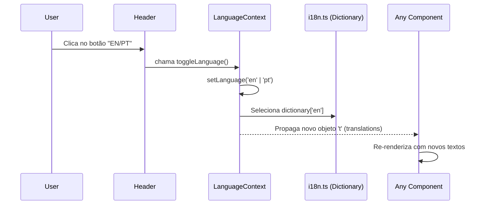

# Arquitetura e Fluxos de Dados - 3G1B Startup

**Documento Técnico Detalhado**
**Data:** 07/12/2025

Este documento complementa o `SYSTEM_DOCS.md`, focando na estrutura interna, fluxo de dados e lógica complexa do sistema.

---

## 1. Arquitetura de Componentes (App Router)

A aplicação utiliza o **Next.js App Router**, onde cada pasta define uma rota e o arquivo `page.tsx` é o ponto de entrada visual. `layout.tsx` atua como um wrapper persistente.

### Diagrama da Árvore de Componentes

```mermaid
graph TD
    Root[Root Layout (src/app/layout.tsx)]
    Root --> Provider[LanguageProvider (Context)]
    Provider --> Body[HTML Body]
    Body --> Header[Header Component]
    Body --> Page[Page Content (children)]
    Body --> Footer[Footer Component]

    Page --> Home[Home Page (src/app/page.tsx)]
    Page --> History[History Page (src/app/history/page.tsx)]

    Home --> Hero[Hero Section]
    Home --> Partners[Partners Section]
    Home --> About[About Section]
    Home --> Blueprint[Blueprint Section]
    Home --> Portfolio[Portfolio Section]
    Home --> Team[Team Section]
    Home --> Contact[Contact Section]

    style Root fill:#f9f,stroke:#333,stroke-width:2px
    style Provider fill:#bbf,stroke:#333,stroke-width:2px
    style Home fill:#dfd,stroke:#333,stroke-width:2px
```

### Explicação
1.  **Root Layout**: Envolve toda a aplicação. É aqui que o `LanguageProvider` é injetado, garantindo que o contexto de tradução esteja disponível globalmente.
2.  **Providers**: Wrappers lógicos que não renderizam UI direta, mas fornecem dados (ex: Tema, Idioma, Autenticação).
3.  **Sections**: A `page.tsx` principal é composta por grandes blocos independentes (Hero, About, etc.), facilitando a manutenção isolada.

---

## 2. Fluxo de Internacionalização (i18n)

O sistema não usa bibliotecas externas pesadas (como `i18next`), mas sim um padrão leve de Dicionário Tipado via Context API.

### Diagrama de Sequência de Dados



### Detalhes Técnicos
*   **Performance**: Como o dicionário é apenas um objeto JavaScript estático (`src/lib/i18n.ts`), a troca é instantânea e não requer requisições de rede.
*   **Tipagem**: O TypeScript infere as chaves do objeto `pt`, garantindo que se você tentar acessar `t.hero.titulo` em vez de `t.hero.title`, o build falhará.

---

## 3. Engine de Animação: Blueprint

A seção **Blueprint** (`src/components/sections/Blueprint.tsx`) é a peça central de engenharia visual do site. Ela sincroniza o scroll do usuário com a renderização de SVG e transformações CSS.

### Lógica de Scroll e Renderização

```mermaid
flowchart LR
    Scroll[User Scrolls Page] --> Hook[useScroll (Framer Motion)]
    Hook --> Progress[scrollYProgress (0.0 a 1.0)]
    Progress --> Spring[useSpring (Physics Smoothing)]
    
    Spring --> Anims{Transformations}
    
    Anims -->|0.0 - 0.1| Title[Fade In & Slide Title]
    Anims -->|0.1 - 0.3| Core[Scale & Rotate Core CPU]
    Anims -->|0.3 - 0.6| Wires[Draw SVG Lines (pathLength)]
    Anims -->|0.5 - 0.8| Chips[Pop In Service Chips]

    subgraph "Render Layer"
        SVG[SVG Element (z-10)]
        HTML[Service Chips (z-30)]
    end
    
    Wires --> SVG
    Chips --> HTML
```

### Sistema de Coordenadas
Para garantir responsividade perfeita, usamos um sistema híbrido:
1.  **SVG (Fios)**: Usa um `viewBox="0 0 1000 1000"`.
    *   Centro: `500, 500`.
    *   Top Left: `200, 200`.
    *   Isso cria um sistema de coordenadas cartesiano fixo, independente do tamanho da tela.
2.  **HTML (Chips)**: Posicionados com porcentagem (`left: 20%`, `top: 20%`) para coincidir matematicamente com os pontos do SVG.
3.  **Z-Index Strategy**:
    *   **Fios (z-10)**: Fundo.
    *   **CPU Central (z-20)**: Meio.
    *   **Chips (z-30)**: Frente (para garantir interatividade e evitar sobreposição visual pelos fios).

---

Documentação gerada automaticamente por **Antigravity AI**.
